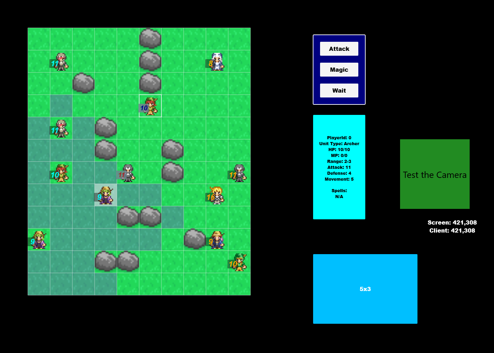
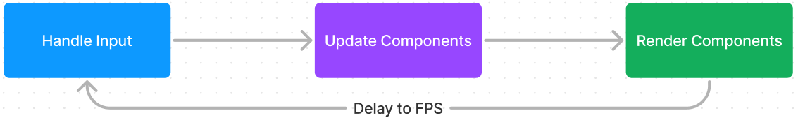

# Game SDK v0.0


_Wow, what great graphics!_

## Why a Game SDK?

There are many Game Engines out there to choose from, but not as many Game Libaries. This is a simple framework for building 2D games to run on .NET Maui, enabling highly portable .NET games to be built without having to learn an engine.

Engines are feature rich and provide you with a lot of functionality out of the box. They also come with rich editors to build your games. Engines, however, are very complicated and have steep learning curves to grasp. Is there a better choice for simple mobile games, for example?

A library keeps you in the code and is designed to be comfortable for people with more line of business application experience, reducing context switching between the game engine editor and code editor. To this end, it is also designed to have a much less steep learning curve as the library itself is relatively small. For this, less is taken care of for you by the engine and so you'll have to handle more responsiblities on your own.

## Game Loop



Game loops typically run at 60 FPS, where each frame, user input will be processed, components will be updated and components will be rendered from the active camera. The game loop requires a Dispatcher in order to accurately time the FPS delay.

### Game Loop Factory

To create a game loop, create a factory as shown below and start running the game.

MainPage.xaml.cs
``` csharp
public partial class MainPage : ContentPage
{
    public MainPage()
    {
        InitializeComponent();

        // Create a game loop factory (can be registered with DI)
        var gameLoopFactory = new GameLoopFactory();

        // Create initial scene
        // See 'Scene' section for details on creating your first scene
        var scene = new BattleGridScene();

        // Create the game loop, rendering to the xaml GameView
        var game = gameLoopFactory.Create(GameView, scene);

        // Start the game
        game.Start();
    }
}
```

MainPage.xaml
``` xml
<?xml version="1.0" encoding="utf-8" ?>
<ContentPage xmlns="http://schemas.microsoft.com/dotnet/2021/maui"
             xmlns:x="http://schemas.microsoft.com/winfx/2009/xaml"
             xmlns:app="clr-namespace:Rpg.Mobile.App"
             BackgroundColor="Black"
             x:Class="Rpg.Mobile.App.MainPage">

    <Grid>
        <app:GameSceneView x:Name="GameView" />
    </Grid>

</ContentPage>
```

## Scene

A game loop will have exactly one active scene. This scene is the orchestrator for the different __components__ shown on screen. The scene will create components and add them to the scene. The game loop will then update all of the components in the active scene and render them.

A scene containts its components as well as the active camera.

``` csharp
    public BattleGridScene()
    {
        // Create a 10/12 grid for the game board
        var grid = new GridComponent(GridClicked, 10, 12);

        // create the background map the size of the grid
        var map = new MapComponent(new(0f, 0f, _grid.Bounds.Width, _grid.Bounds.Height));

        // Add the game to the scene. The map will now start receiving updates and render requests
        Add(map);

        // Add grid to map. Grid will be relative to parent for rendering and hit detection.
        map.AddChild(grid);
    }
```

## Component

Components represent the different elements that can be displayed in your scene. They can handle user input as well. To make this work, the Component must pass its bounds to the base class. This will be changed to be vector, rotation and size based in the future.

Components may have 0-1 parent and 0+ children. A components absolute position will be the sum of the previous positions of the parents. A component rendered at (0,0) will render at (0,0) of its parent and (0,0) of the scene if no parent is specified.

The following can be done with a component:
``` csharp
public interface IComponent
{
    // Component Hierarchy
    IComponent? Parent { get;  }
    IEnumerable<IComponent> Parents { get; }
    IReadOnlyCollection<IComponent> Children { get; }
    IEnumerable<IComponent> Descendents { get; }
    IEnumerable<IComponent> All { get; }

    // Rendering
    bool IgnoreCamera { get; } // Rendered relative to camera or relative to screen
    RectF AbsoluteBounds { get; }
    PointF Position { get; set; } // Local to parent

    // Handle Input
    void OnTouchUp(IEnumerable<PointF> touches);

    // Control Component Hierarchy
    IComponent RemoveChild(IComponent child);
    void SetParent(IComponent? parent);
}
```

### Sprite

A sprite is a special component that displays an image. To create a sprite, you may call:

``` csharp
var sprite = new Sprite(image);
```

Sprites have the following properties:
``` csharp 
IImage Sprite { get; set; }
float Scale { get; private set; } = 1f;
bool IsVisible { get; set; } = true;
```

This is a good use case for when you just want to display a 2D image in your game world. To display an image and add complex behavior to it, extend SpriteComponentBase, which will allow you to handle the Update loop as normal:


``` csharp
public class BattleUnitComponent : SpriteComponentBase
{
    public BattleUnitComponent(IImage sprite) : base(sprite);

    // Add Game Logic
}
```

## Camera

Scenes have exactly one ActiveCamera with which is the perspective the view will be rendered from. The main active gamera is currently created as part of GameLoopFactory and attached to the scene. Cameras have an 'Offset,' which represents its current position. With tweening, the camera can be moved from place to place.

## Tween

If you want your components to move and not teleport, use a Tween! You can tween from one point to another at a certain speed, or tween between multiple segments in a path.

The following extensions help to setup tweens. 
``` csharp
MultiTween TweenTo(this PointF start, float speed, params PointF[] path);
SpeedTween TweenTo(this PointF end, float speed);
SpeedTween TweenTo(this PointF start, PointF end, float speed);
MultiTween TweenTo(this SpeedTween speedTween, PointF end, float speed);
MultiTween TweenTo(this MultiTween multi, PointF end, float speed);
```

To use:
``` csharp
private ITween<PointF>? _cameraTween;

public void MiniMapClicked(PointF touch)
{
    _cameraTween = ActiveCamera.Offset.TweenTo(target, speed: 400f);
        //.TweenTo(secondTarget, speed: 1000f) for second path afer first
}

public override void Update(float deltaTime)
{
    if (_cameraTween is not null)
        // Pass in delta time to make sure rate across screen is consistent if frames render at different speeds.
        ActiveCamera.Offset = _cameraTween.Advance(deltaTime);
}
```

## Rng

Provide a convenient API to get game friendly random data. This is an instance with an interface, designed to be injected for unit testing.

``` csharp
double Percent();

double Double(double min, double max);
double Double(double max);

int Int(int min, int max);
int Int(int max);
```

# Special Thanks

## Antifareas
https://opengameart.org/content/antifareas-rpg-sprite-set-1-enlarged-w-transparent-background-fixed for the RPG sprites used in the sample game.

## ansimuz
https://opengameart.org/content/rpg-town-pixel-art-assets for background tiles used in sample game.

## isaiah658
https://opengameart.org/content/isaiah658s-pixel-pack-2 for background tiles used in sample game.